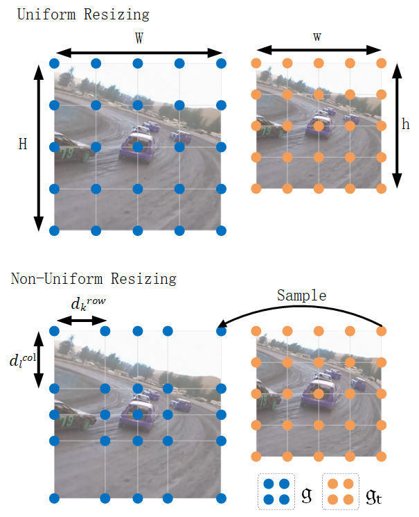

# ZoomTrack

This is the official implementation for the **NeurIPS 2023** spotlight paper [ZoomTrack: Target-aware Non-uniform Resizing for Efficient Visual Tracking](https://arxiv.org/abs/2310.10071)

Authors: [Yutong KOU](https://Kou-99.github.io), [Jin Gao](https://people.ucas.edu.cn/~jgao?language=en), [Bing Li](http://www.ia.cas.cn/sourcedb_ia_cas/cn/iaexpert/201707/t20170715_4833365.html), Gang Wang, [Weiming Hu](https://people.ucas.ac.cn/~huweiming?language=en), Yizheng Wang and Liang Li

[[Models](https://drive.google.com/drive/folders/1nWIku-9zF1v23obcGbL0zXIQ1TOuhdZX?usp=sharing)] [[Raw Results](https://drive.google.com/drive/folders/1KwRzDXujBZNZVu-7x3b70mG28dtNmpLU?usp=drive_link)] [[Training Logs](https://drive.google.com/drive/folders/1kHn-NXsswvMiyjsV8RKcZ9vgwio_COoE?usp=drive_link)]



## Install the environment
Use the Anaconda (CUDA 11.3)
```
conda env create -f zoom.yaml
```

## Set project paths
Run the following command to set paths for this project
```
python tracking/create_default_local_file.py --workspace_dir . --data_dir ./data --save_dir ./output
```
After running this command, you can also modify paths by editing these two files
```
lib/train/admin/local.py  # paths about training
lib/test/evaluation/local.py  # paths about testing
```

## Data Preparation
Put the tracking datasets in ./data. It should look like this:
   ```
   ${PROJECT_ROOT}
    -- data
        -- lasot
            |-- airplane
            |-- basketball
            |-- bear
            ...
        -- got10k
            |-- test
            |-- train
            |-- val
        -- coco
            |-- annotations
            |-- images
        -- trackingnet
            |-- TRAIN_0
            |-- TRAIN_1
            ...
            |-- TRAIN_11
            |-- TEST
   ```

## Training
Download pre-trained [MAE ViT-Base weights](https://dl.fbaipublicfiles.com/mae/pretrain/mae_pretrain_vit_base.pth) and put it under `$PROJECT_ROOT$/pretrained_models` (different pretrained models can also be used, see [MAE](https://github.com/facebookresearch/mae) for more details).

```
python tracking/train.py --script ostrack --config zoom --save_dir ./output --mode multiple --nproc_per_node 4 --use_wandb 1
```

Replace `--config` with the desired model config under `experiments/ostrack`. We use [wandb](https://github.com/wandb/client) to record detailed training logs, in case you don't want to use wandb, set `--use_wandb 0`.

## Evaluation
Download the model weights and put the downloaded weights on `$PROJECT_ROOT$/output/checkpoints/train/ostrack`

Change the corresponding values of `lib/test/evaluation/local.py` to the actual benchmark saving paths

Some testing examples:
- LaSOT or other off-line evaluated benchmarks (modify `--dataset` correspondingly)
```
python tracking/test.py ostrack zoom --dataset lasot --threads 8 --num_gpus 4
python tracking/analysis_results.py ostrack zoom lasot
```
- GOT10K-test
```
python tracking/test.py ostrack zoom_got --dataset got10k_test --threads 8 --num_gpus 4
python lib/test/utils/transform_got10k.py --tracker_name ostrack --cfg_name zoom_got
```
- TrackingNet
```
python tracking/test.py ostrack zoom --dataset trackingnet --threads 8 --num_gpus 4
python lib/test/utils/transform_trackingnet.py --tracker_name ostrack --cfg_name zoom
```

## Visualization or Debug 
[Visdom](https://github.com/fossasia/visdom) is used for visualization. 
1. Alive visdom in the server by running `visdom`:

2. Simply set `--debug 5` during inference for visualization, e.g.:
```
python tracking/test.py ostrack zoom --dataset lasot  --debug 5
```
3. Open `http://localhost:8097` in your browser (remember to change the IP address and port according to the actual situation).


## Acknowledgments
* Thanks for the [OSTrack](https://github.com/botaoye/OSTrack) and [PyTracking](https://github.com/visionml/pytracking) library, which helps us to quickly implement our ideas.
* We use the implementation of the ViT from the [Timm](https://github.com/rwightman/pytorch-image-models) repo.  


## Citation
If our work is useful for your research, please consider citing:

```Bibtex
@inproceedings{kou2023zoomtrack,
 author = {Kou, Yutong and Gao, Jin and Li, Bing and Wang, Gang and Hu, Weiming and Wang, Yizheng and Li, Liang},
 booktitle = {Advances in Neural Information Processing Systems},
 pages = {50959--50977},
 publisher = {Curran Associates, Inc.},
 title = {ZoomTrack: Target-aware Non-uniform Resizing for Efficient Visual Tracking},
 volume = {36},
 year = {2023}
}
```
